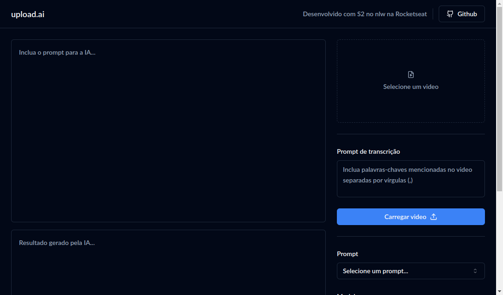

<h1 align="center">NLW AI</h1>

> Trilha Mastery da NLW IA da Rocketseat.

<p align="center">
  <a href="">Projeto</a>&nbsp;&nbsp;&nbsp;|&nbsp;&nbsp;&nbsp;
  <a href="">Tecnologias</a>&nbsp;&nbsp;&nbsp;|&nbsp;&nbsp;&nbsp;
  <a href="">Rodar projeto</a>&nbsp;&nbsp;&nbsp;|&nbsp;&nbsp;&nbsp;
  <a href="">Licença</a>
</p>

<p align="center">
  
</p>

<h2 id="project"> Projeto</h2>

Neste projeto trabalhamos com inteligência Artificial onde geramos títulos e descrições para vídeos do YouTube.



<h2> Tecnologias</h2>

Abaixo as tecnologias que utilizamos para o desenvolvimento do projeto:

> Frontend
 - React
 - Typescript
 - Tailwind CSS
 - Axios
 - Vite
 - FFmpeg
 - Shadcn UI

> Backend
 - Node.js
 - Typescript
 - Fastify
 - Dotenv
 - Zod
 - OpenA
 - Prisma

<h2 id="usage"> Rodar projeto</h2>

Para rodar o projeto localmente, precisamos ter o `Node.js` e o `npm` instalados.

Siga o passo a passo:
> git clone
```
$ git clone https://github.com/brunogoncalvesferreira/nlw.ai.git
```

> Acesse a pasta
```
$ cd nlw.ai
```

> Acesse a pasta nlw-ai-web
```
$ cd nlw-ai-web
```

> Instale as dependências
```
$ npm install
```

> Inciar o frontend 
```
$ npm run dev
```

> Acesse a pasta nlw-ai-backend
```
$ cd nlw-ai-backend
```

> Instale as dependências
```
$ npm install
```

> Execute as migrações
```
$ npx prisma migrate dev
```

> Iniciar servidor
```
$ npm run dev
```

⚠️ Importante: Crie um arquivo .env na raiz da pasta `nlw-ai-backend` no campo DATABASE_URL, especificar a URL do banco de dados que deseja utilizar. Crie sua conta na [OpenAI](https://openai.com/), obtenha sua chave da API e preencha o campo OPENAI_KEY com a sua chave.

<h2 align="license"> Licença</h2>

Este projeto está sob a licença MIT.

<div style="display: flex;">
  <a href="https://www.linkedin.com/in/bruno-goncalves-ferreira/" target="_blank"></a>
  <a href="mailto:brunogoncalveferreira@outlook.com"></a> 
  <a href="https://www.instagram.com/brunogonferreira/" target="_blank"></a>
</div>
